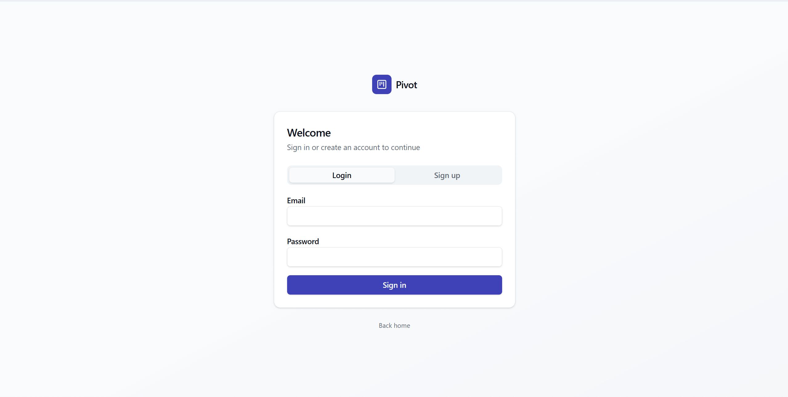
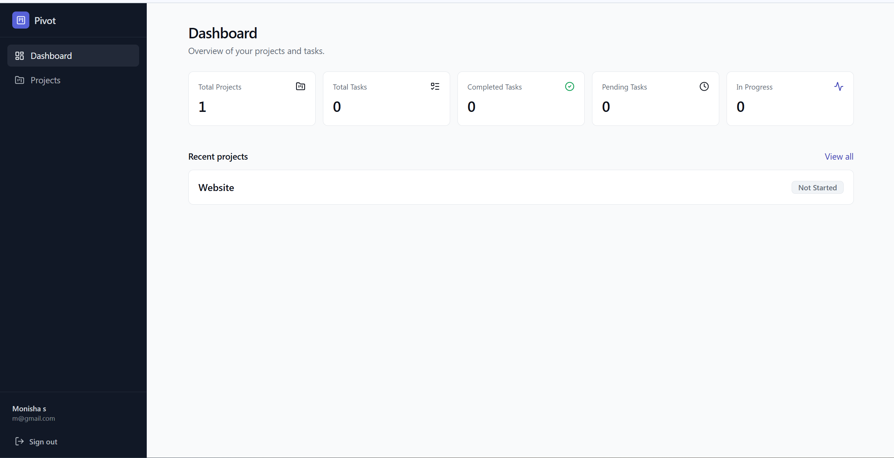

# Pivot - Project Management System

A web-based Project Management System that allows users to create and manage projects, organize tasks, track progress, and monitor project statistics through an interactive dashboard.

## Overview

Pivot is designed to help users efficiently manage projects and tasks in one place. Users can create projects, add tasks, monitor progress, and view overall productivity metrics through a centralized dashboard.

## Features

### Authentication
- User Registration
- User Login
- User Logout
- Secure Password Hashing
- JWT Authentication
- Protected Routes

### Project Management
- Create Projects
- View Project Details
- Update Projects
- Delete Projects
- Track Project Status
  - Not Started
  - In Progress
  - Completed

### Task Management
- Create Tasks
- Edit Tasks
- Delete Tasks
- Mark Tasks as Completed
- Assign Priority Levels
  - Low
  - Medium
  - High
- Track Task Status
  - Pending
  - In Progress
  - Completed

### Dashboard
- Total Projects
- Total Tasks
- Completed Tasks
- Pending Tasks
- Projects In Progress
- Recent Projects Overview

### Search & Filtering
- Search Projects by Name
- Search Tasks by Name
- Filter Projects by Status
- Filter Tasks by Status
- Filter Tasks by Priority

## Screenshots

### Authentication Page



### Dashboard



## Technology Stack

### Frontend
- React.js / Next.js
- Tailwind CSS
- TypeScript
- ShadCN UI

### Backend
- Node.js
- Express.js
- REST API

### Database
- PostgreSQL / MySQL

### Authentication & Security
- JWT Authentication
- bcrypt Password Hashing
- Authentication Middleware
- Protected Routes
- Rate Limiting

## Project Structure

```text
project-management-system/
│
├── client/
│   ├── src/
│   ├── components/
│   ├── pages/
│   └── services/
│
├── server/
│   ├── controllers/
│   ├── routes/
│   ├── middleware/
│   ├── models/
│   └── services/
│
├── database/
│   └── schema.sql
│
├── screenshots/
│   ├── login.png
│   └── dashboard.png
│
└── README.md
